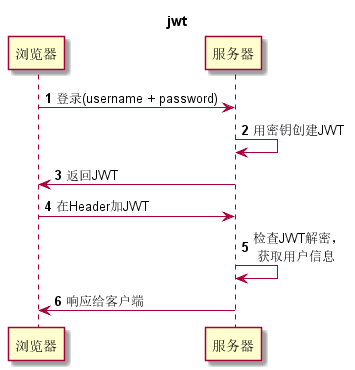

# OAuth2和JWT
- 前面说到的SSO每次都要经过Uaa服务去验证当前合法性，而且需要查询该Token对应的用户的权限。这样请求次数太多。
- 采用SSO和JWT，uaa服务只验证一次，返回JWT，返回得JWT包含了用户的所有信息，包括权限信息。

## JWT简介
- JWT由三部分组成，分别以.分割，组成部分如下：
    - Header
    - Payload
    - Signature
- 通常格式如下：
```
xxx.yyy.zzz
```

1. Header
   - Header由两部分组成：令牌的类型（即JWT）和使用的算法类型，如HMAC\SHA256和RSA。
   ```
   {
       "alg": "HS256",
       "typ": "JWT"
   }
   ```
   - 将Header用Base64编码作为JWT的第一部分

2. Payload
    - 这是JWT的第二部分，包含了用户的一些信息和Claim(声明、权力)。有3种类型的Claim:保留、公开和私人。
    ```
    {
        "sub" : "1234567890",
        "name" : "amy",
        "admin" : true
    }
    ```
    - Payload进行Base64编码作为第二部分

3. Signature
    - 要创建签名部分，需要将Base64编码后的Header、Payload和密钥进行签名：
    ```
    HMACSHA256(
        base64(header)+ "." + base64(payload),
        secret
    )
    ```  

### JWT的应用场景
- 认证。用户登录成功获取JWT后，每次请求都携带JWT。该JWT包含了用户信息、权限点等信息。
- 信息交换。JWT使用签名加密，安全性很高。

### 如何使用JWT
- 如下图所示:
- 

---
## 案例分析
- 本例中有3个工程，分别是eureka-server、auth-service和user-service。
- auth-service负责授权，返回JWT，该JWT包含了用户的基本信息和权限点信息，通过RSA加密。
- 用户获取到JWT之后，每次请求都在请求头中传递该JWT，从而资源服务能够根据JWT来继续权限认证。


### auth-service
#### POM依赖

#### 配置类
- WebSecurity与之前的没什么不同(尝试把HttpSecurity的配置改回之前那种试试)
```
public class WebSecurityConfig extends WebSecurityConfigurerAdapter {
    @Autowired
    private UserDetailsService userDetailsService;

    @Override
    protected void configure(HttpSecurity http) throws Exception {
        http.authorizeRequests().anyRequest()
                .authenticated()
                .and()
                .csrf().disable()
                .exceptionHandling()
                .authenticationEntryPoint(((request, response, authException) ->
                        response.sendError(HttpServletResponse.SC_UNAUTHORIZED)))
                .and()
                .httpBasic();

    }

    @Override
    protected void configure(AuthenticationManagerBuilder auth) throws Exception {
        auth.userDetailsService(userDetailsService)
                .passwordEncoder(new BCryptPasswordEncoder());
    }

    @Bean
    @Override
    public AuthenticationManager authenticationManagerBean() throws Exception {
        return super.authenticationManagerBean();
    }

}
``` 
- OAuth2Config的配置与之前有较大的变化。
    - EnableAuthorizationServer开始授权服务功能
    - 之前是把Token存储到数据库，现在是使用JWT，因此需要改TokenStore，把TokenStore改为JwtTokenStore

```
@Configuration
@EnableAuthorizationServer
public class OAuth2AuthorizationConfig
        extends AuthorizationServerConfigurerAdapter  {

    @Autowired
    private AuthenticationManager authenticationManager;

    @Autowired
    private UserDetailsService userDetailsService;

    @Override
    public void configure(ClientDetailsServiceConfigurer clients) throws Exception {
        clients.inMemory()
                .withClient("user-service")
                .secret(passwordEncoder().encode("123456"))
                .authorizedGrantTypes("refresh_token","password")
                .scopes("service")
                .accessTokenValiditySeconds(3600);

    }

    @Override
    public void configure(AuthorizationServerEndpointsConfigurer endpoints) throws Exception {
        endpoints
                .tokenStore(tokenStore())
                .tokenEnhancer(jwtTokenEnhancer())
                .authenticationManager(authenticationManager);
//                .userDetailsService(userDetailsService);
    }

    @Override
    public void configure(AuthorizationServerSecurityConfigurer security) throws Exception {
        security
                .tokenKeyAccess("permitAll()")
                .checkTokenAccess("isAuthenticated()");
    }
    @Bean
    public PasswordEncoder passwordEncoder(){
        return new BCryptPasswordEncoder();
    }
    @Bean
    public TokenStore tokenStore(){
        return new JwtTokenStore(jwtTokenEnhancer());
    }

    @Bean
    protected JwtAccessTokenConverter jwtTokenEnhancer(){
        KeyStoreKeyFactory keyFactory = new KeyStoreKeyFactory(
                new ClassPathResource("auth-jwt.jks"),
                "auth".toCharArray());
        JwtAccessTokenConverter converter = new JwtAccessTokenConverter();
        converter.setKeyPair(keyFactory.getKeyPair("auth-jwt"));
        return converter;
    }
}


```
- 使用下面说到命令从jks文件中生成crt证书，放到其他的资源服务器上，用于提取公钥。
- 为了防止jks被编译，在POM文件中加入如下代码，忽略掉crt jks p12结尾的文件。
```
<build>
        <plugins>
            <plugin>
                <groupId>org.springframework.boot</groupId>
                <artifactId>spring-boot-maven-plugin</artifactId>
                <configuration>
                    <nonFilteredFileExtensions>
                        <nonFilteredFileExtension>crt</nonFilteredFileExtension>
                        <nonFilteredFileExtension>jks</nonFilteredFileExtension>
                        <nonFilteredFileExtension>p12</nonFilteredFileExtension>
                    </nonFilteredFileExtensions>
                </configuration>
            </plugin>
        </plugins>
    </build>
```
#### 生成jks文件
- 生成jks文件需要用到keytool工具，该工具jdk自带，在bin目录下。
- 命令如下：
    - genkeypair 生成密钥
    - alias 别名
    - validity 配置jks文件的过期时间(天)
    - keyalg 加密类型
    - dname是证书个人信息
        - CN为你的姓名
        - OU为你的组织单位名称
        - O为你的组织名称
        - L为你所在的城市名称
        - S为你所在的省份名称
        - C为你的国家名称
    - keypass和sotrepass是密码，必须大于6位
    - keysotre是文件名字
```
keytool -genkeypair -alias auth-jwt -validity 3650 -keyalg RSA -dname "CN=jwt,OU=jtw,O=jtw,L=wuhan,S=hubei,C=CH" -keypass auth-123456 -keystore auth-jwt.jks -storepass auth-123456
```
- 执行该命令生成私钥，只允许Uaa持有，并用作加密JWT。
- 解密JWT需要公钥，获取jks公钥命令如下：
```
keytool -list -rfc -keystore auth-jwt.jks | openssl x509 -inform pem -pubkey
```
- 由于windows上下载不了openssl，因此采用导出证书的方式，导出公钥证书，在资源服务里再从证书中读取公钥。
```
keytool -export -alias auth-jwt -file auth.crt -keystore auth-jwt.jks
```
- 读取公钥代码：
```
import sun.misc.BASE64Encoder;
public static String extractPublicKey(InputStream inputStream) throws CertificateException {
    CertificateFactory cf = CertificateFactory.getInstance("X.509");
    X509Certificate cert = (X509Certificate)cf.generateCertificate(
            inputStream);

    RSAPublicKey publicKey = (RSAPublicKey) cert.getPublicKey();
    BASE64Encoder encoder = new BASE64Encoder();
    String verifierKey = "-----BEGIN PUBLIC KEY-----\n" + encoder.encode(publicKey.getEncoded())
            + "\n-----END PUBLIC KEY-----";
    return verifierKey;
}
```

### user-service服务
- user service是一个资源服务，访问auth-service来获得jwt。
#### POM依赖
- 主要引入eureka-client Oauth2 数据库的连接，以及声明式调用Feign和Hystrix的起步依赖。
```
<dependencies>
        <dependency>
            <groupId>org.springframework.boot</groupId>
            <artifactId>spring-boot-starter-data-jpa</artifactId>
        </dependency>
        <dependency>
            <groupId>org.springframework.boot</groupId>
            <artifactId>spring-boot-starter-web</artifactId>
        </dependency>
        <dependency>
            <groupId>org.springframework.cloud</groupId>
            <artifactId>spring-cloud-starter-netflix-eureka-client</artifactId>
        </dependency>
        <dependency>
            <groupId>org.springframework.cloud</groupId>
            <artifactId>spring-cloud-starter-netflix-hystrix</artifactId>
        </dependency>
        <dependency>
            <groupId>org.springframework.cloud</groupId>
            <artifactId>spring-cloud-starter-oauth2</artifactId>
        </dependency>
        <dependency>
            <groupId>org.springframework.cloud</groupId>
            <artifactId>spring-cloud-starter-openfeign</artifactId>
        </dependency>

        <dependency>
            <groupId>mysql</groupId>
            <artifactId>mysql-connector-java</artifactId>
            <scope>runtime</scope>
        </dependency>
        <dependency>
            <groupId>org.springframework.boot</groupId>
            <artifactId>spring-boot-starter-test</artifactId>
            <scope>test</scope>
        </dependency>
    </dependencies>
```
- 同时在build里也要加上上面说的过滤掉crt文件的代码。
```
<configuration>
    <nonFilteredFileExtensions>
        <nonFilteredFileExtension>crt</nonFilteredFileExtension>
        <nonFilteredFileExtension>jks</nonFilteredFileExtension>
        <nonFilteredFileExtension>p12</nonFilteredFileExtension>
    </nonFilteredFileExtensions>
</configuration>
```
#### 配置Application
- Application主要还是配置eureka，数据库，和开启feign等的配置。
- 由于获取jwt的时间可能较长，因此要给feign的超时时间设置长一点，不然的话第一次会报read time out的错误。
```
server:
  port: 6500

eureka:
  client:
    service-url:
        defaultZone:
          http://localhost:8761/eureka/
spring:
  application:
    name: user-serivce
  datasource:
    driver-class-name: com.mysql.cj.jdbc.Driver
    url: "jdbc:mysql://localhost:3306/spring_cloud_auth?
    useSSL=false&useUnicode=true&
    characterEncoding=UTF-8&
    allowPublicKeyRetrieval=true&serverTimezone=GMT%2B8"
    username: root
    password: root
  jpa:
    hibernate:
      ddl-auto: update
    show-sql: true
ribbon:
  ConnectTimeout: 5000
```

#### 配置Resource Server
- 在配置Resource Sever之前，需要注入JwtTokenStore类型的Bean。
- 创建一个JwtConfig类，完成JWT的配置。
- JwtTokenStore类型的Bean需要配置一个JwtAccessTokenConverter类型的Bean，该Bean用作JWT转换器。
- JwtAccessTokenConverter需要设置VerifierKey，也就是公钥，使用上面提到过的方法从crt证书中提取公钥。
```
@Configuration
public class JwtConfig {
    @Autowired
    JwtAccessTokenConverter jwtAccessTokenConverter;

    @Bean
    public TokenStore tokenStore(){
        return new JwtTokenStore(jwtAccessTokenConverter);
    }

    @Bean
    protected JwtAccessTokenConverter jwtTokenEnhancer() throws IOException, CertificateException {
        JwtAccessTokenConverter converter = new JwtAccessTokenConverter();
        //使用最正规的证书签名方式
        Resource resource = new ClassPathResource("auth.crt");
        String publicKey = JwtUtil.extractPublicKey(resource.getInputStream());
        converter.setVerifierKey(publicKey);

        //使用普通字符串签名
//        converter.setSigningKey("auth-key");
        return converter;
    }
}
```

- 然后配置Resource Server。新建一个ResourceServerConfig类，继承ResourceServerConfigurerAdapter类，在类上加上开启资源服务和方法保护的注解。
- Resource Server需要配置HttpSecurity和ResourceServerSecurityConfigurer这两项。
- HttpSecurity配置了哪些请求需要验证，哪些不需要。
- ResourceServerSecurityConfigurer配置tokenSotre。

```
@Configuration
@EnableResourceServer
@EnableGlobalMethodSecurity(prePostEnabled = true)
public class ResourceServerConfig extends ResourceServerConfigurerAdapter {
    @Autowired
    TokenStore tokenStore;
    @Override
    public void configure(HttpSecurity http) throws Exception {
        http.authorizeRequests()
                .antMatchers("/user/registry/**","/user/login/**").permitAll()
                .anyRequest().authenticated();
    }
    @Bean
    public PasswordEncoder passwordEncoder(){
        return new BCryptPasswordEncoder();
    }

    @Override
    public void configure(ResourceServerSecurityConfigurer resources) throws Exception {
        resources.tokenStore(tokenStore);
    }
}
```
#### 编写用户登录接口
- 用户登录接口需要往auth-service申请token。
- 在service层添加一个login方法：
```
 @Override
public UserLoginDTO login(String username, String password) {
    User user = userDao.findByUsername(username);
    if(user ==null){
        throw new UserLoginException("username error");
    }
    if(!passwordEncoder.matches(password, user.getPassword())){
        throw new UserLoginException("password error");
    }

    //使用feign获取token
    JWT jwt = authServiceClient.getToken("Basic dXNlci1zZXJ2aWNlOjEyMzQ1Ng==",
            "password",
            username,
            password);
    if(jwt == null){
        throw new UserLoginException("error internal");
    }
    UserLoginDTO dto = new UserLoginDTO();
    dto.setJwt(jwt);
    dto.setUser(user);
    return dto;
}
```
- 其中，AuthServiceClient是Feign的客户端，需要启动类通过@EnableFeignClients开启Feign客户端功能。
```
@EnableFeignClients
public class UserServiceApplication {

```
- AuthServiceClient通过网auth-service服务远程调用`/oauth/token`API接口，获取JWT。
- 在该接口中需要在请求头传入Authorization信息，并需要传请求参数认证类型grant_type、用户名和密码。
```
@FeignClient(value ="jwtauth-service")
public interface AuthServiceClient {
    @PostMapping(value = "/uaa/oauth/token")
    JWT getToken(@RequestHeader(value = "Authorization") String authorization,
                 @RequestParam("grant_type") String type,
                 @RequestParam("username") String username,
                 @RequestParam("password") String password);

}
```
- JWT是一个javaBean，包含了access_token，token_type，refresh_token等信息。
```
public class JWT {
    private String access_token;
    private String token_type;
    private String refresh_token;
    private int expires_in;
    private String scope;
    private String jti;

}
```

- UserLoginDTO包含了一个User和一个JWT对象，用于返回数据的实体：
```
public class UserLoginDTO {
    private JWT jwt;
    private User user;
}
```

- 使用统一异常处理类来返回错误的信息。
```
public class UserLoginException extends RuntimeException {
    public UserLoginException(String message){
        super(message);
    }
    @ControllerAdvice
    @ResponseBody
    public static class ExceptionHandle{
        @ExceptionHandler(UserLoginException.class)
        public ResponseEntity<String> handleException(Exception e){
            return new ResponseEntity(e.getMessage(), HttpStatus.OK);
        }
    }
}
```

- 在Controller中编写一个登陆的API接口，调用service层的login方法。
```
    @GetMapping("login/{name}/{password}")
    public UserLoginDTO login(
        @PathVariable("name") String username,
                              @PathVariable("password") String password){
        return userService.login(username, password);
    }
```

- 然后其他方法就可以通过加上注解@PreAuthorize("hasAuthority('')")来开启验证了。
```
@PreAuthorize("hasAuthority('USER')")
```

## 总结
- 用户通过登录结果获取授权服务的token
- 获取成功后每次访问资源服务的请求中都需要携带该Token。
- 资源服务通过公钥解密Token，解密成功后可以获取用户信息和权限信息。

### 优缺点
- 架构的优点在于一次获取，多次使用。
- 缺点在于权限发生变化必须重新获取Token。
    - 就算重新获取了，原来的Token没有过期也仍旧可以使用。所以需要根据具体的业务逻辑来设置Token的过期时间。

- 一种改进方式是将登录成功后获取的Token缓存在网关上，如果用户的权限更改，将网关上的缓存的Token删除。
- 当请求经过网关，判断请求的Token在缓存中是否存在，如果不存在，就提示用户重新登录。

### 根据Token获取信息的类
- 下面是一个根据请求获取当前用户、权限、Token的信息。
```
public class UserUtil {
    /**
     * 获取当前用户
     * @return
     */
    public static String getCurrentPrinciple(){
        return (String) SecurityContextHolder.getContext().getAuthentication().getPrincipal();
    }
    public static String getCurrentToken(){
        ServletRequestAttributes requestAttributes = (ServletRequestAttributes)RequestContextHolder.currentRequestAttributes();
        HttpServletRequest request = requestAttributes.getRequest();
        String authorization = request.getHeader("Authorization");
        String[] contents = authorization.split(" ");
        String token = "";
        if(contents.length == 2){
            token = contents[1];
        }
        return token;

    }

    /**
     * 获取权限
     * @return
     */
    public static List<GrantedAuthority> getCurrentAuthorities(){
        return (List<GrantedAuthority>)SecurityContextHolder.getContext().getAuthentication().getAuthorities();
    }
}

```

### 注意事项
- 如果使用zuul网关转发请求，一定要设置sensitiveHeaders为空，该属性用于过滤敏感头部信息，而默认的敏感头部信息包括了Authorization。
```
	/**
	 * List of sensitive headers that are not passed to downstream requests. Defaults to a
	 * "safe" set of headers that commonly contain user credentials. It's OK to remove
	 * those from the list if the downstream service is part of the same system as the
	 * proxy, so they are sharing authentication data. If using a physical URL outside
	 * your own domain, then generally it would be a bad idea to leak user credentials.
	 */
	private Set<String> sensitiveHeaders = new LinkedHashSet<>(
			Arrays.asList("Cookie", "Set-Cookie", "Authorization"));

```