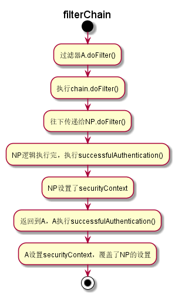

# Spring Security

<!-- TOC -->

- [Spring Security](#spring-security)
    - [Spring Security提供的安全模块](#spring-security%e6%8f%90%e4%be%9b%e7%9a%84%e5%ae%89%e5%85%a8%e6%a8%a1%e5%9d%97)
    - [Spring Boot Security案例](#spring-boot-security%e6%a1%88%e4%be%8b)
        - [构建Spring boot Security工程](#%e6%9e%84%e5%bb%baspring-boot-security%e5%b7%a5%e7%a8%8b)
            - [POM依赖](#pom%e4%be%9d%e8%b5%96)
        - [配置Spring Security](#%e9%85%8d%e7%bd%aespring-security)
            - [配置WebSecurityConfigurerAdapter](#%e9%85%8d%e7%bd%aewebsecurityconfigureradapter)
            - [配置HttpSecurity](#%e9%85%8d%e7%bd%aehttpsecurity)
        - [Spring Security方法级别上的保护](#spring-security%e6%96%b9%e6%b3%95%e7%ba%a7%e5%88%ab%e4%b8%8a%e7%9a%84%e4%bf%9d%e6%8a%a4)
        - [从数据库中读取用户的认证信息](#%e4%bb%8e%e6%95%b0%e6%8d%ae%e5%ba%93%e4%b8%ad%e8%af%bb%e5%8f%96%e7%94%a8%e6%88%b7%e7%9a%84%e8%ae%a4%e8%af%81%e4%bf%a1%e6%81%af)
            - [创建User实体](#%e5%88%9b%e5%bb%bauser%e5%ae%9e%e4%bd%93)
            - [创建Role实体](#%e5%88%9b%e5%bb%barole%e5%ae%9e%e4%bd%93)
            - [UserDao](#userdao)
            - [UserService](#userservice)
            - [Spring Security 配置](#spring-security-%e9%85%8d%e7%bd%ae)
    - [注意事项](#%e6%b3%a8%e6%84%8f%e4%ba%8b%e9%a1%b9)
        - [登录部分](#%e7%99%bb%e5%bd%95%e9%83%a8%e5%88%86)
        - [静态资源被拦截问题](#%e9%9d%99%e6%80%81%e8%b5%84%e6%ba%90%e8%a2%ab%e6%8b%a6%e6%88%aa%e9%97%ae%e9%a2%98)
- [深入](#%e6%b7%b1%e5%85%a5)
    - [插入过滤器](#%e6%8f%92%e5%85%a5%e8%bf%87%e6%bb%a4%e5%99%a8)
        - [addFilter](#addfilter)
    - [关于自定义登录问题](#%e5%85%b3%e4%ba%8e%e8%87%aa%e5%ae%9a%e4%b9%89%e7%99%bb%e5%bd%95%e9%97%ae%e9%a2%98)
        - [过滤链](#%e8%bf%87%e6%bb%a4%e9%93%be)
            - [AbstractAuthenticationProcessingFilter源码解析](#abstractauthenticationprocessingfilter%e6%ba%90%e7%a0%81%e8%a7%a3%e6%9e%90)
            - [Authentication解析](#authentication%e8%a7%a3%e6%9e%90)
            - [自定义验证码过滤器](#%e8%87%aa%e5%ae%9a%e4%b9%89%e9%aa%8c%e8%af%81%e7%a0%81%e8%bf%87%e6%bb%a4%e5%99%a8)

<!-- /TOC -->
- Spring Security(下称SS)是Spring的一个安全组件。
- SS采用 "安全层" 的概念，使每一层都尽可能安全，连续的安全层可以达到全面的防护。
- SS可以在Controller层、Service层、DAO层等以加注解的方式来保护应用程序的安全。
- SS提供了细粒度的权限控制，可以精细到每一个API接口、每一个业务的方法。

## Spring Security提供的安全模块
- 在安全验证方面， SS提供了很多的安全验证模块。大部分的验证模块来自第三方的权威机构。
    - HTTP BASIC 头认证
    - HTTP Digest 头认证
    - HTPP X.509客户端证书交换认证
    - LDAP
    - 基于表单的认证
    - OpenID验证
    - 基于预先建立的请求头的验证
    - CAS
    - 远程方法调用(RMI)和HttpInvoker的认证
    - 自动 记住我的身份验证
    - 匿名验证
    - Run-as身份验证(每一次调用都需要提供身份标识)
    - Java认证和授权服务
    - Java EE 容器认证
    - Kerberos
    - Java开源的单点登录
    - OpenNMS网络管理平台
    - AppFuse
    - AndroMDA
    - Mule ESB
    - Direct Web Request
    - Grails
    - Tapestry
    - JTrac
    - Jasypt
    - Roller
    - Elastic Path
    - Atlassina Crowd
    - 自己创建的认证系统

## Spring Boot Security案例

### 构建Spring  boot Security工程

#### POM依赖
- 需要如下几个依赖：
```
<dependencies>
    <dependency>
        <groupId>org.springframework.boot</groupId>
        <artifactId>spring-boot-starter-security</artifactId>
    </dependency>
    <dependency>
        <groupId>org.springframework.boot</groupId>
        <artifactId>spring-boot-starter-thymeleaf</artifactId>
    </dependency>
    <dependency>
        <groupId>org.springframework.boot</groupId>
        <artifactId>spring-boot-starter-web</artifactId>
    </dependency>

    <dependency>
        <groupId>org.springframework.boot</groupId>
        <artifactId>spring-boot-starter-test</artifactId>
        <scope>test</scope>
    </dependency>
    <dependency>
        <groupId>org.springframework.security</groupId>
        <artifactId>spring-security-test</artifactId>
        <scope>test</scope>
    </dependency>
</dependencies>
```

### 配置Spring Security

#### 配置WebSecurityConfigurerAdapter
- 创建完工程后，需要配置SS。新建一个SecurityConfig类，作为配置类。
- 作为配置类，它继承WebSecurityConfigurerAdapter类。
- 加上@EnableWebSecurity注解，开启WebSecurity的功能。
- 注入AuthenticationManagerBuilder类的Bean。
```
@EnableWebSecurity
@Configuration
public class SecurityConfig extends WebSecurityConfigurerAdapter {
@Autowired
    @Override
    protected void configure(AuthenticationManagerBuilder auth) throws Exception {
        auth.inMemoryAuthentication()
                .passwordEncoder(new BCryptPasswordEncoder())//新版本需要指定加密格式
                .withUser("user")
                .password(new BCryptPasswordEncoder().encode("123456"))//需要转换成加密版本
                .roles("USER");
    }
}
```
- 上述代码做了Spring Security的基本配置，并通过AuthenticationManagerBuilder在内存中创建了一个认证用户的信息。该用户名为user，密码为123456，有USER的角色。
- 新版本需要指定加密格式，以及内存密码需要换成加密后的内容
- 代码虽少，但是做了很多安全防护的工作，包括：
    - 应用的每一个请求都需要认证
    - 自动生成一个登陆表单
    - 可以用username和password认证
    - 用户可以注销
    - 阻止了CSRF攻击
    - Session Fixation保护
    - 安全Header集成了以下内容。

#### 配置HttpSecurity
- WebSecurityConfigurerAdapter配置了如何验证用户信息。
- 而HttpSecurity负责配置以下部分:
    - 哪些用户需要身份验证
    - 是否支持基于表单的验证
    - 哪些资源需要验证

- 新建一个SecurityConfig类继承WebSecurityConfigurerAdapter作为HttpSecurity的配置类。
- 可以使用上面新建的类。

- 通过复写configure(HttpSecurity)方法来配置HttpSecurity。
```
 @Override
protected void configure(HttpSecurity http) throws Exception {
 http.addFilterBefore(new CodeAuthenticationFilter("/login"), UsernamePasswordAuthenticationFilter.class);
    http.authorizeRequests()
            .antMatchers("/css/**","/index","/login").permitAll()
            .antMatchers("/user/**").hasRole("USER")
            .antMatchers("/blogs/**").hasRole("USER")
            .and()
            .formLogin().loginPage("/login").failureUrl("/login-error") //自动创建了一个Loginform
            .loginProcessingUrl("/login")//处理登录流程的URL
            .successForwardUrl("/login-success")
            .successHandler(new SuccessHandler())//登录成功后的处理器
            .failureHandler(new FailureHandler())//失败的处理器
            .and()
            .exceptionHandling().accessDeniedPage("/401")
            .and()
            .csrf().disable();//要禁用掉跨站请求伪造

}
```
- successForwardUrl 成功后跳转的url，一定要允许post，否则会报错
- login-page指定的用户自定义的登录页面
- default-target-url登录成功以后默认跳转到的页面
- authentication-failure-url登录失败以后跳转到的页面
- username-parameter指定登录表单中用户名的input中name，如果这里不配置，则默认为username
- password-parameter指定登录表单中密码的input中name，如果这里不配置，则默认为password
- logout-success-url成功退出以后跳转到的地址 
- 上述代码比较好懂
    - antMatchers是要匹配的API，可以传入多个String类型
    - permitAll代表不需要验证，可以直接访问
- 代码采用链式编码，每次hasRole或permitAll等方法都会返回一个ExpressionInterceptUrlRegistry，代表前面的API已经处理，可以重新处理新的API。
- and返回一个HttpSecurity，可以做其他新的操作。
- formLogin 使用表单登录方式，还有openid和Oauth2的方式。
- .csrf().disable()，要禁用掉跨站请求伪造，因为这边是用POSTMAN来发送请求。

- 最前面是在UserName拦截器前增加了一个验证码拦截器。

### Spring Security方法级别上的保护
- SS提供方法级别的安全支持。
- 写一个配置类继承WebSecurityConfigurerAdapter，并加上相关注解，就可以开启方法级别的保护：
```
@EnableWebSecurity
@Configuration
@EnableGlobalMethodSecurity(prePostEnabled = true)
public class SecurityConfig extends WebSecurityConfigurerAdapter {
```
- @EnableGlobalMethodSecurity开启方法级别的保护，括号后的参数可选，包括如下参数:
    - prePostEnable: SS的Pre和Post注解是否可用，即@PreAuthorize和@PostAuthorize。
    - secureEnabled: SS的@Secured注解是否可用。
    - jsr250Enabled: SS对JSR-250的注解是否可用。

- 一般来说，只会用到prePostEnabled。因为@PreAuthorize和@PostAuthorize更适合方法级别的安全控制。并且支持Spring EL表达式。
    - @PreAuthorize在进入方法前进行权限认证。
    - @PostAuthorize方法执行后进行权限认证。应用场景较少。

- 权限注解的写法：
```
@PreAuthorize("hasRole('ADMIN')")
or
@PreAuthorize("hasAuthority('ADMIN')")
这两种方法等价
```
- 多个权限点的写法：
```
@PreAuthorize("hasAnyRole('ADMIN','USER')")
or
@PreAuthorize("hasAnyAuthority('ADMIN','USER')")
```
- 如果没有权限，就会被重定向到权限不足的界面。

### 从数据库中读取用户的认证信息
- 加上Mysql的依赖
```
 <dependency>
    <groupId>org.springframework.boot</groupId>
    <artifactId>spring-boot-starter-data-jpa</artifactId>
</dependency>
<dependency>
    <groupId>mysql</groupId>
    <artifactId>mysql-connector-java</artifactId>
    <scope>runtime</scope>
</dependency>

```

#### 创建User实体
- User实体需要实现UserDetails接口。
- UserDetail是实现SS认证信息的核心接口。getUsername不一定返回uername，可以是其他用户信息。
- getAuthorities方法返回的是该用户设置的权限信息，这里是角色信息，但是你可以返回其他信息。
- 其他的接口一般返回true，可以从方法名判断是有什么用的。
- 注意映射的多对多Roles关系不能懒加载，必须Eager,把角色全部读取出来。
```
@Entity(name = "auth_user")
public class User implements UserDetails, Serializable {
    @Id
    @GeneratedValue(strategy = GenerationType.IDENTITY)
    private long id;
    @Column(name = "user_name")
    String username;
    @Column(name = "password")
    String password;
    @ManyToMany(fetch = FetchType.EAGER)
    @JoinTable(name = "auth_role_user_mapping",
            joinColumns = {@JoinColumn(name = "user_id", referencedColumnName = "id")},
            inverseJoinColumns = {@JoinColumn(name = "role_id", referencedColumnName = "id")})
    @JsonManagedReference
    Set<Role> roles = new HashSet<>(0);

    public User(String username, String password) {
        this.username = username;
        this.password = password;
    }

    public User() {

    }

    public long getId() {
        return id;
    }

    public void setId(long id) {
        this.id = id;
    }

    public void setUsername(String username) {
        this.username = username;
    }

    public void setPassword(String password) {
        this.password = password;
    }

    public Set<Role> getRoles(){
        return roles;
    }
    public boolean addRole(Role role){
        return roles.add(role);
    }
    public boolean removeRole(Role role){
        return roles.remove(role);
    }
    @Override
    public Collection<? extends GrantedAuthority> getAuthorities() {
        return roles;
    }

    @Override
    public String getPassword() {
        return password;
    }

    @Override
    public String getUsername() {
        return username;
    }

    @Override
    public boolean isAccountNonExpired() {
        return true;
    }

    @Override
    public boolean isAccountNonLocked() {
        return true;
    }

    @Override
    public boolean isCredentialsNonExpired() {
        return true;
    }

    @Override
    public boolean isEnabled() {
        return true;
    }
}
```
#### 创建Role实体
- Role类实现了GrantedAuthority接口，getAuthority方法返回该类的权限点。权限点可以为任何字符串，根据你的业务需求来定义。在这里返回Role的name
```
@Entity(name = "auth_role")
public class Role implements GrantedAuthority {
    @Id
    @GeneratedValue(strategy = GenerationType.IDENTITY)
    private long id;

    @Column(name = "name")
    String name;
    @Override
    public String getAuthority() {
        return getName();
    }

    public long getId() {
        return id;
    }

    public void setId(long id) {
        this.id = id;
    }

    public String getName() {
        return name;
    }

    public void setName(String name) {
        this.name = name;
    }
}
```

#### UserDao
- Dao层就是使用JPA接口去访问数据库，这里我们继承JpaRepository即可。同时加上注解@Repository，注入SpringIOC容器。
```
@Repository
public interface UserDao extends JpaRepository<User, Long> {
    User findByUsername(String username);
}
```

#### UserService
- Service层需要实现UserDetailService接口，该接口是根据用户名获取该用户的所有信息，包括用户信息和权限点。
```
@Service
public class UserService implements UserDetailsService {
    @Autowired
    private UserDao userDao;

    @Override
    public UserDetails loadUserByUsername(String username) throws UsernameNotFoundException {
        return userDao.findByUsername(username);
    }
    public void addUser(User user){
        userDao.save(user);
    }
}
```

#### Spring Security 配置
- 修改SS的配置，从内存读取改为从数据库中读取。
- 同时还需要修改密码加密策略，加入一个bean
```
    protected void configure(AuthenticationManagerBuilder auth) throws Exception {
        auth.userDetailsService(userDetailsService).passwordEncoder(new BCryptPasswordEncoder());
    }
```
- 为了方便添加用户，新增一个addUser的接口，用来添加用户。
    - 自动注入一个PasswordEncoder用来加密密码
    - 一个UserService用来操作数据库
    - 添加角色可以直接创建一个只设置了id的Role。
```
@RestController
public class UserController {
    @Autowired
    private UserService userService;
    @Autowired
    private PasswordEncoder passwordEncoder;
    @RequestMapping("addUser/{name}/{password}/{role}")
    public Map<String, Object> addUser(@PathVariable("name") String name,
                                       @PathVariable("password") String password,
                                       @PathVariable("role") int role)
    {
        Map<String, Object> maps = new HashMap<>();
        User user = new User(name, passwordEncoder.encode(password));
        Role role1 = new Role();
        role1.setId(role);
        user.addRole(role1);
        userService.addUser(user);
        maps.put("status", 1);
        maps.put("message","success");
        return maps;
    }
}
```
  
## 注意事项

### 登录部分
- loginProcessingUrl是form表单提交的action地址，不需要自己去写对应的action
- successForwardUrl是成功后跳转的地址，需要自己去写对应的action，而且必须允许Post，否则会报错。

### 静态资源被拦截问题
- 要么在开启全局拦截的情况下把静态资源目录加入例外，要么不使用全局拦截。
```
 http.authorizeRequests()
                .antMatchers("/assets/**","/js/**","/login").permitAll()
```


# 深入
## 插入过滤器
- 向HttpSecurity的Filter链上插入自定义的Filter,插入到UsernamePasswordAuthenticationFilter的位置上。插入方法有addFilterBefore,addFilterAt,addFilterAfter。
- 这个地方需要注意使用addFilterAt并不是说能替换掉原有的Filter,事实上框架原有的Filter在启动HttpSecurity配置的过程中，都由框架完成了其一定程度上固定的配置，是不允许更改替换的。
- 根据测试结果来看，调用addFilterAt方法插入的Filter，会在这个位置上的原有Filter之前执行。

### addFilter
- addFilter好像必须是他本来就有的Filter
```
public HttpSecurity addFilter(Filter filter) {
		Class<? extends Filter> filterClass = filter.getClass();
		if (!comparator.isRegistered(filterClass)) {
			throw new IllegalArgumentException(
					"The Filter class "
							+ filterClass.getName()
							+ " does not have a registered order and cannot be added without a specified order. Consider using addFilterBefore or addFilterAfter instead.");
		}
		this.filters.add(filter);
		return this;
	}
```
- 他做了一个isRegistered的处理
## 关于自定义登录问题
- 我们可以看到，Spring Security的登录部分的认证是内部实现的，不需要我们写逻辑，只需要我们指定登录的路由，同时把表单提交到该路由即可。
- 但是如果我们希望实现自己的逻辑该怎么做？例如我们希望除了用户名和密码，还要加上验证码等消息呢？
- 经过网上查阅和结构分析，大概有如下几个地方可以做文章：
    1. 过滤链，FilterChain，这是网上普遍的做法，在登录过滤器之前加一个自定义的过滤器拦截，在里面做逻辑判断。
    2. SuccessHandler ，成功后跳转的处理器，看看是否能在这里做文章。
    3. UsernamePasswordAuthenticationFilter，这是验证的过滤器，看看是否可以重写或继承该类来实现自己的验证逻辑。

### 过滤链
- SS的过滤器形成了一条过滤链，一个一个往下执行，我们可以在UsernamePasswordAuthenticationFilter之前加上一个过滤器，在该过滤器中做一些操作，然后决定是否往下继续执行后续的过滤链。

#### AbstractAuthenticationProcessingFilter源码解析
- 主要关注doFilter函数
```
public void doFilter(ServletRequest req, ServletResponse res, FilterChain chain)
			throws IOException, ServletException {
```
- 首先是签名，传递了一个Request和Response对象，还有一个过滤链对象，
    - 前两者可以转换成HttpServletXXX，通过它可以获取到Session和参数等内容。
    - FilterChain 可以把req和res继续往下传递

```
HttpServletRequest request = (HttpServletRequest) req;
HttpServletResponse response = (HttpServletResponse) res;

if (!requiresAuthentication(request, response)) {
    chain.doFilter(request, response);

    return;
}

if (logger.isDebugEnabled()) {
    logger.debug("Request is to process authentication");
}

```
- 第一段代码，把请求和响应转成Http，然后去判断当前请求路径是否要过滤的路径，过滤器都有一个过滤地址，requiresAuthentication会判断当前地址是不是，如果不是就直接传递给下一个过滤器。
```
protected boolean requiresAuthentication(HttpServletRequest request,
        HttpServletResponse response) {
    return requiresAuthenticationRequestMatcher.matches(request);
}
```

- 第二段是关键代码。我们拆成两部分来看，分别是try和catch。
- 先定义了一个认证，使用attemptAuthentication来进行逻辑判断，如果返回为空，就是认证尚未完成，直接返回。
- 否则的话传递给sessionStrategy的onAuthentication做一些操作。该函数的功能是在发生新身份验证时执行与HTTP会话相关的功能。
    - AbstractAuthenticationProcessingFilter的默认sessionStrategy是一个NullAuthenticatedSessionStrategy，即onAuthentication为空，不做任何操作。
```
Authentication authResult;

try {
    authResult = attemptAuthentication(request, response);
    if (authResult == null) {
        // return immediately as subclass has indicated that it hasn't completed
        // authentication
        return;
    }
    sessionStrategy.onAuthentication(authResult, request, response);
}
```
- 然后是catch部分。
    - catch部分分为2个异常，但是都会去执行失败unsuccessfulAuthentication函数，该函数会记录一些日志和把登陆失败信息传递给rememberMeServices，同时把req和res参数传递给失败处理器，执行失败处理器的函数。
```
catch (InternalAuthenticationServiceException failed) {
    logger.error(
            "An internal error occurred while trying to authenticate the user.",
            failed);
    unsuccessfulAuthentication(request, response, failed);

    return;
}
catch (AuthenticationException failed) {
    // Authentication failed
    unsuccessfulAuthentication(request, response, failed);

    return;
}
```
- 最后就是认证成功的部分
- 可以看到，若continueChainBeforeSuccessfulAuthentication为true，才会继续往下传递，否则直接传递给successfulAuthentication函数，执行成功处理器的逻辑。因此如果我们希望过滤链往下执行，就必须设置该参数为true，默认为false。
```
// Authentication success
if (continueChainBeforeSuccessfulAuthentication) {
    chain.doFilter(request, response);
}

successfulAuthentication(request, response, chain, authResult);
```
- 在successfulAuthentication函数中设置了Security的上下文。
```

SecurityContextHolder.getContext().setAuthentication(authResult);
rememberMeServices.loginSuccess(request, response, authResult);
// Fire event
if (this.eventPublisher != null) {
    eventPublisher.publishEvent(new InteractiveAuthenticationSuccessEvent(
            authResult, this.getClass()));
}

successHandler.onAuthenticationSuccess(request, response, authResult);
```
- 这就产生了一个问题。如下图：
- 
- A的authentication会覆盖NP的Authentication。
- 解决这个问题有几个思路
    1. 重写A的successfulAuthentication逻辑，只执行成功处理器的onAuthenticationSuccess。
        - 实际上A只是部分认证，因此的确不应该设置loginSuccess和认证上下文。
    2. 重写doFilter，自己控制逻辑。
        - 这样可以做的更细一点，但是有时候并没有必要这样写。  

#### Authentication解析
- 

#### 自定义验证码过滤器
- 实际上自定义验证码过滤器的Authentication我们最后是要抛弃掉的，全程都没用到。所以这里我们可以选择重写doFilter，并且自己写一个成功处理器，不做任何操作。这样我们就避免了还需要写一个Authentication实现类的问题。
```
public class CodeAuthenticationFilter extends AbstractAuthenticationProcessingFilter {
    private boolean isOpenValidateCode = true;
    private String mockCode = "1234";
    public CodeAuthenticationFilter(String pattern){
        //指定请求地址，拦截哪个URL
        super(new AntPathRequestMatcher(pattern, "POST"));
        //获取失败处理器
        SimpleUrlAuthenticationFailureHandler failureHandler = (SimpleUrlAuthenticationFailureHandler)getFailureHandler();

        //失败后跳转到指定页面
        failureHandler.setDefaultFailureUrl("/error");
        //也可以指定自定义的失败处理器，做其他操作，如前后端分离
//        setAuthenticationFailureHandler(failureHandler);
    }

    /**
     * 这是过滤链执行的主要函数
     * @param req
     * @param res
     * @param chain
     * @throws IOException
     * @throws ServletException
     */
    @Override
    public void doFilter(ServletRequest req, ServletResponse res, FilterChain chain) throws IOException, ServletException {
        //获取到request和response,就可以取出表单的内容了
        HttpServletRequest request = (HttpServletRequest) req;
        HttpServletResponse response = (HttpServletResponse) res;
        //可以获取到session传递一些信息

        HttpSession session = request.getSession();

        if(isOpenValidateCode) {
            String code = request.getParameter("code");
            if(validateCode(code)){
                
            }
            else{
                session.setAttribute("errorMsg", "code Error");
                return;
            }
        }
        //继续执行过滤链的下一个过滤器
        chain.doFilter(req, res);

    }

    /**
     * 验证函数
     * @param code
     * @return
     */
    private boolean validateCode(String code){
        return mockCode.equals(code);
    }
    /**
     * 尝试认证
     * 影响到DoFilter是否往下执行，有3个可能的情况
     * 1. 返回Authentication，代表认证完成，不会继续往下执行
     * 2. 过程中抛出AuthenticationException异常，代表认证异常
     * unsuccessfulAuthentication会被执行
     * 3. 返回null,代表认证不完整，直接返回
     * @param httpServletRequest
     * @param httpServletResponse
     * @return
     * @throws AuthenticationException
     * @throws IOException
     * @throws ServletException
     */
    @Override
    public Authentication attemptAuthentication(HttpServletRequest httpServletRequest, HttpServletResponse httpServletResponse) throws AuthenticationException, IOException, ServletException {
        return null;
    }
}

```
- 我们有2个选择
1. 是模仿UsernamePasswordAuthenticationFilter那样，不重写doFilter，只写attemptAuthentication的逻辑，让父类来控制是否往下传递。
    - attemptAuthentication一共有3种可能
        - 返回Authentication，代表认证成功，往下执行
        - 抛出异常，认证失败，执行失败处理器
        - 返回null，认证不完整，直接结束。

2. 重写doFilter，自己决定是否往下传递chain，自己来决定是否调用失败处理器等操作。


- 主要有几点：
1. 在构造器中指定拦截哪个URL
2. 指定失败处理器或失败跳转URL
3. 编写doFilter逻辑，决定是否往下传递过滤
4. 编写attemptAuthentication函数，决定当前认证是否已经完整。

- 参考网址：https://www.cnblogs.com/MrSi/p/8032936.html
